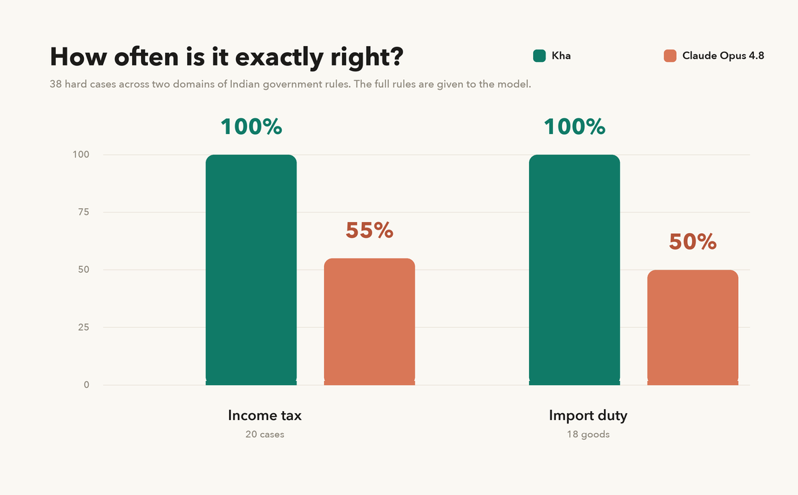
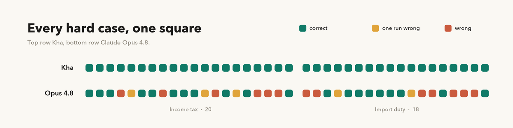
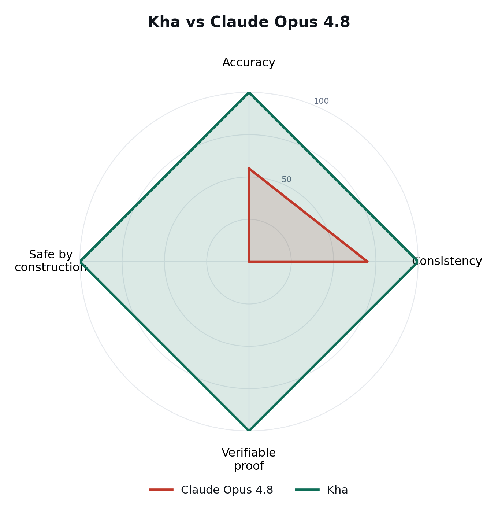

<h1 align="center">ख · Kha</h1>
<p align="center"><b>An open-source framework for building 100% reliable AI agents.</b></p>
<p align="center">The agent acts inside a proven environment that computes and certifies every result.<br>Answers are computed by the environment, not guessed by the model.</p>

---

## What is Kha

Kha puts an AI inside an environment. The AI is free to think and act, but its actions are bounded
by the environment's rules, the same way a person is free yet still cannot break the laws of
physics. Because the AI only ever supplies inputs and the environment computes every result, you
can rely on the outcome completely: the AI cannot cheat, cannot escape, and cannot produce a wrong
result, whatever it believes.

On its own an AI is confidently unreliable. Asked to compute a real income tax or import duty, a
leading general-purpose model often returns a wrong figure and then justifies that wrong figure
fluently (our experiments below show exactly this). That is fine for a conversation, but it is why
you cannot yet hand an AI a job that has to be correct.

Kha changes the arrangement. You write the rules once, prove them, load them as an environment, and
drop the AI inside. The AI does not know the rules and never computes the answer, so it cannot game
them or slip past them. Every result comes from the proven environment, and every step the AI takes
inside it is recorded and checkable. For that task the AI becomes reliable, with a proof.

An environment is like a room with fixed laws. The AI moves freely inside, but the walls, the
floor, and gravity are not up for negotiation. Build one room per job (income tax, customs duty,
and so on), load it, and the AI inside can only ever act within its laws.

## How Kha works

The AI's only job is to supply inputs. The environment owns the computation and the output, and
because the AI never sees the rules, it cannot bend them or escape them.

**The recipe:**

1. **Find the rules**, from an authoritative public source. Never invent them.
2. **Write them once as a spec**, one source of truth (`spec.py`).
3. **Prove the spec once**, Lean kernel certifies figures (zero axioms), Z3 proves guardrails over all inputs.
4. **Load the proven environment**, runtime executes the oracle generated from the same spec.
5. **Drop a model in**, it extracts inputs; the environment computes results.

**Under the hood**, the three backends are generated from that single source, so they can never drift:

```
                         ┌──────────► Lean   →  kernel certifies concrete results (zero axioms)
   spec.py  (one source) ├──────────► SMT    →  Z3 proves guardrails over ALL inputs (unsat)
                         └──────────► oracle →  the function the runtime executes
                                                 (all three co-generated, they cannot drift)

   run:   model supplies inputs  →  environment computes the result  →  result + derivation
          (never the answer)         (the proven oracle)                (with a saved certificate)
```

The proof is a one-time build step. It writes a `proof_certificate.json`; the runtime just loads it.

Because every consequential step happens inside the environment, the whole run is inspectable: you
get the result, its derivation, and a saved certificate. The AI can say anything; only the
environment's proven figure reaches the user. See [Benchmarks](#benchmarks) for the measured gap
between a state-of-the-art model on its own and the same task run inside a Kha environment.
See [`theory.md`](theory.md) for the intuitions behind the design.

## Quickstart

```bash
git clone https://github.com/ibedevesh/kha && cd kha
pip install -e .                        # installs kha (dep: z3-solver)
# Lean (elan) is needed only for the proving step:  https://leanprover.github.io  →  export PATH="$HOME/.elan/bin:$PATH"

cd examples/import_duty
python prove.py                         # one-time: certify figures + guardrails → proof_certificate.json

export KHA_BASE_URL=... KHA_API_KEY=... KHA_MODEL=...   # any OpenAI-compatible endpoint
python serve.py                         # http://127.0.0.1:8800/  (chat) and /compare
```

Bring your own model: Kha depends on no provider. `kha.llm` speaks any OpenAI-compatible endpoint
via `KHA_BASE_URL` / `KHA_API_KEY` / `KHA_MODEL`, or pass your own callable.

## Benchmarks

We tested **Claude Opus 4.8** (state of the art, July 2026) on **38 hard cases across two domains of
Indian government rules**: income tax (the Finance Bill, 2026) and import duty (the Customs Tariff
First Schedule, CBIC). These are the cases where the rules interact and the computation gets hard,
marginal relief just above the surcharge thresholds, the dividend and capital-gains surcharge
carve-out, old-regime age brackets, company relief, and, for imports, recalling the official duty
rate for a product and running the BCD to SWS to IGST cascade. The model is handed the full method;
the correct answer is the kernel-proven engine. Kha runs that same engine, so it is exact by
construction.



Opus 4.8 was fully correct on just over half: **11 of 20 income-tax cases (55%)**, **9 of 18 imports
(50%)**, **20 of 38 overall (53%)**. It was wrong on the rest, with errors up to **₹47.8 lakh**, and
it gave a **different answer across runs** on the hardest cases. Every wrong answer came with a
fluent, confident justification. Kha was exact on all 38, every run, kernel-certified.



Two everyday examples of the failure:
- **Income tax:** a dividend and capital-gains case. ₹34.9M one run, ₹40.1M the next, correct ₹39.7M.
- **Import duty:** cashew nuts. The real Basic Customs Duty is 30%, Opus 4.8 used about 2.5% and
  priced the duty at **₹78,875** against the correct **₹3,96,500**, wrong by five times, and the
  same wrong figure both runs. It looks reliable. It is not.



A model can be accurate, and even consistent, on a good day. It still scores zero on the two axes
that matter for real work: a **verifiable proof** of the answer, and being **safe by construction**
(a model can output any number, Kha cannot output a value the rules forbid).

Raw per-case results: [`assets/benchmark_opus48.json`](assets/benchmark_opus48.json) (income tax)
and [`assets/duty_benchmark_opus48.json`](assets/duty_benchmark_opus48.json) (import duty).

### Why this matters

The gap widens exactly where the stakes rise. Tax, customs, **medicine, law**, any real job with
complex interacting rules is where a model fails most, and where a single wrong answer costs the
most, in money or in lives. If a model is wrong on even 1 case in 100, no one will let it do the job,
because that 1 could be theirs. Reliability here cannot be a score you nudge upward; it has to be
total, and it has to be provable. That is what Kha is for.

Sources: Finance Bill, 2026; Customs Tariff Act First Schedule (CBIC).

## Layout

```
kha/            core: spec (one→Lean/SMT/oracle) · verify · prove · env (loop, ledger) · assistant · llm
examples/
  import_duty/  official cascade + 11,972 real HSN→BCD rates
  income_tax/   Finance Bill slabs, surcharge, marginal relief, cess
theory.md       the intuitions behind the design
```

## The honest boundary

Kha proves the engine **obeys the spec**, exactly. Two things remain human, by nature: that the
**spec faithfully captures the real rules** (reviewed once, when authored), and that the model
**extracts the inputs correctly** (the one soft step, it supplies causes, the environment computes
effects). Everything between is proven and out of the model's hands.

## License

MIT.
